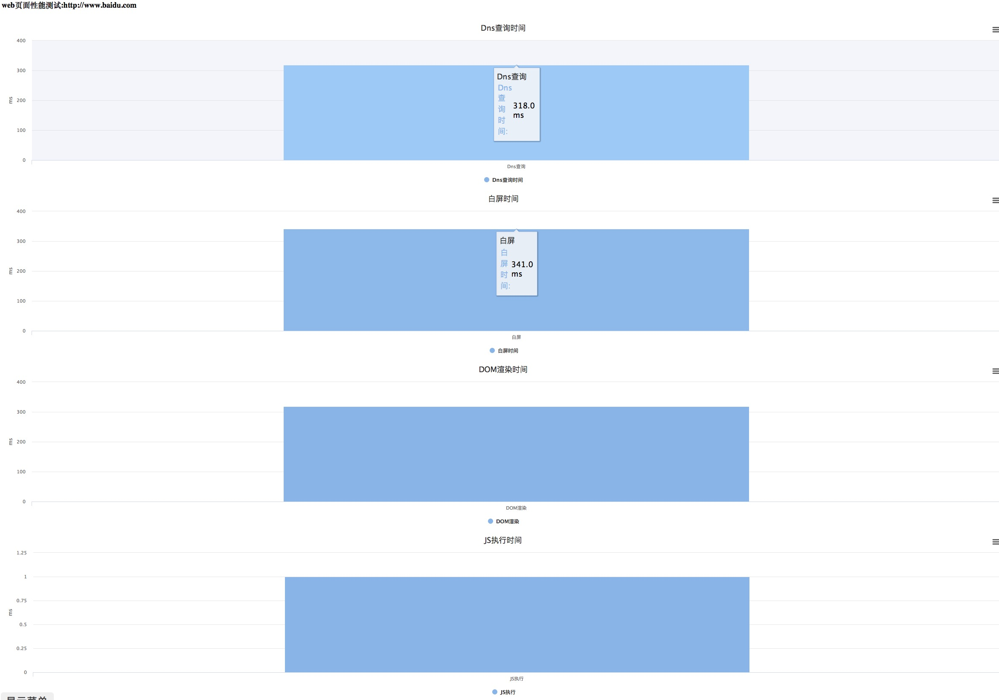

# web页面性能测试工具
```$xslt
可以测试dns查询、dom渲染、js执行、白屏时间、首屏时间
```

# jar包
```
jar包在target目录下
```

# 执行命令
```$xslt
-w:页面地址
-r:报告地址
-c:依赖的chromedriver路径

java -jar webtest-1.0.0.jar -w http://www.baidu.com -r /Users/xinxi/Desktop/report -c /Users/xinxi/Desktop/WebTest/target/chromedriver
```
# 报告
```$xslt
会在-r的路径下生产报告
```


# web页面加载过程

